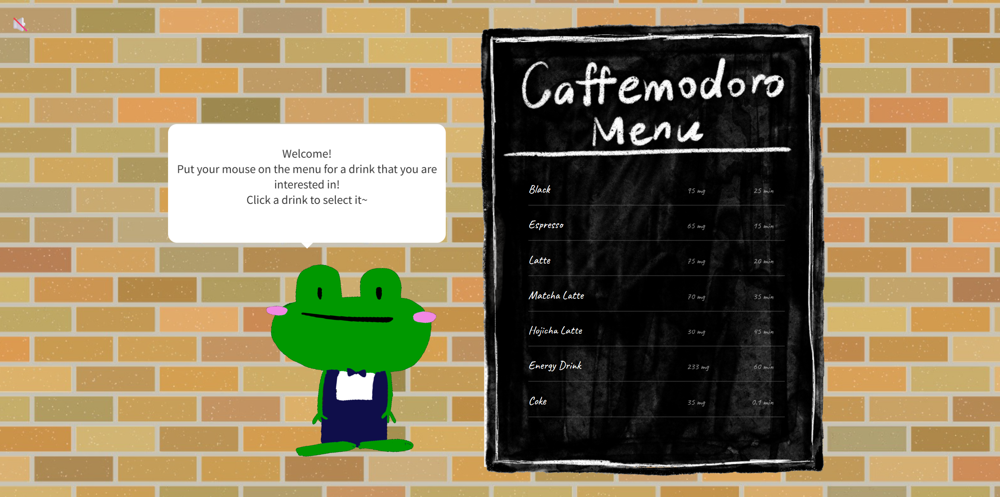
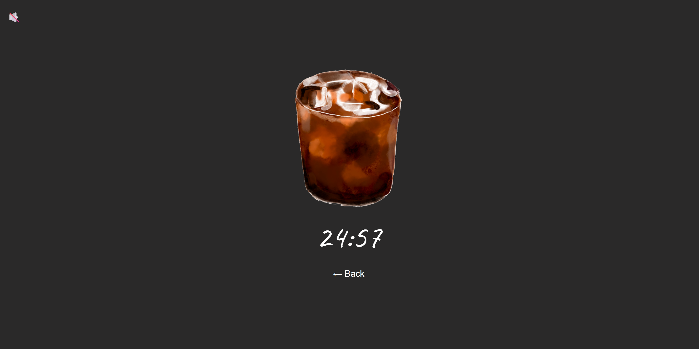
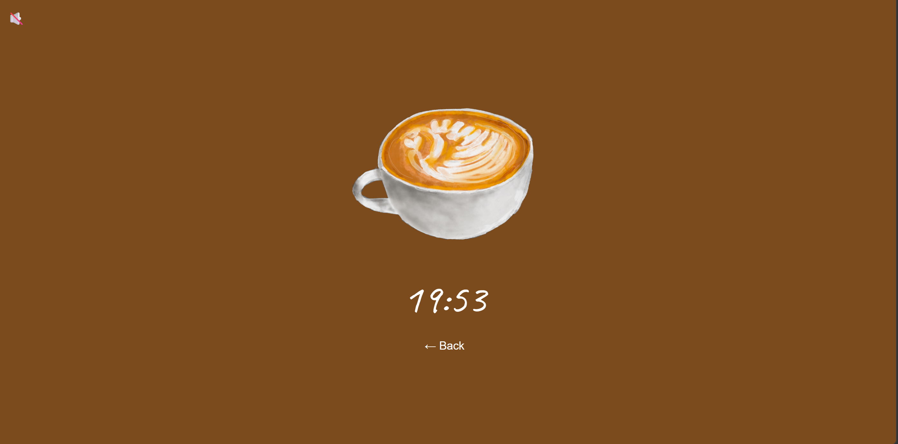
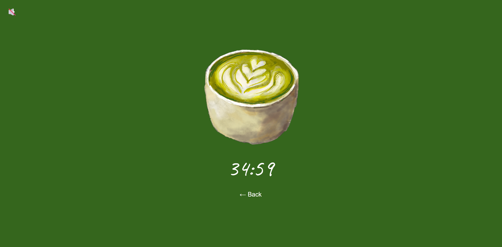
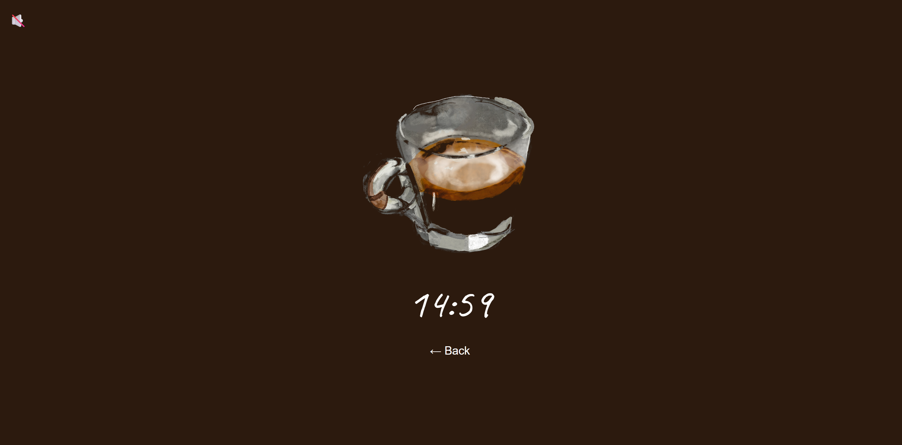
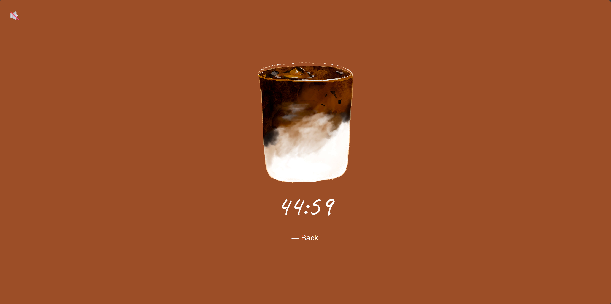
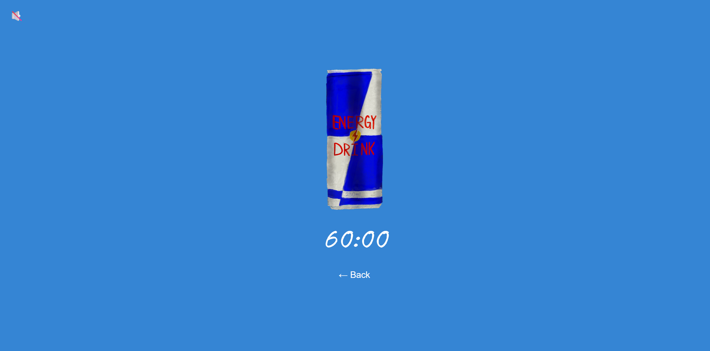
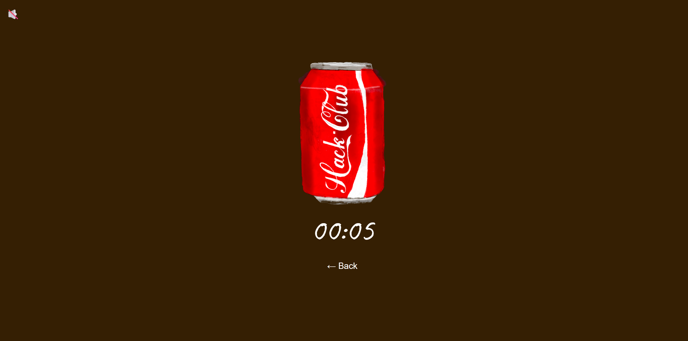

# Caffemodro

You've definitely heard of Pomodoro before, as you can tell from the name, this is Pomodoro for caffeine addicts

# 1. What it does

Apparently it is a Focus App, but instead of having your phone locked for 25mins with a boring tomato, you got to select your own locked in time while enjoying a cup of cozy digital caffeine drink

# 2. Motivation

For pure fun! And as an opportunity for me to enjoy drawing!
This is inspired by a side challenge from flavortown, I know it's being a long time since flavortown ended, but I still want to wrap this project up.

# 3. How to use it

1. Select a drink from the menu based on your mode
2. Press the start button and lock in while enjoying the drink
3. Timer stopped, great! You've just gone through a efficient period of time with a company of a cute drink!

# 4. Screenshots

# 5. Tech stack

Nothing fancy here, this was built for fun and for me to enjoy drawing :)

- **HTML/CSS/JavaScript**-the whole app, no frameworks
- **Claude**-debugging, skipping tedious process (ex. duplicating sound effects)

# 5. Demo
https://yyonggg2.github.io/Caffemodoro/
